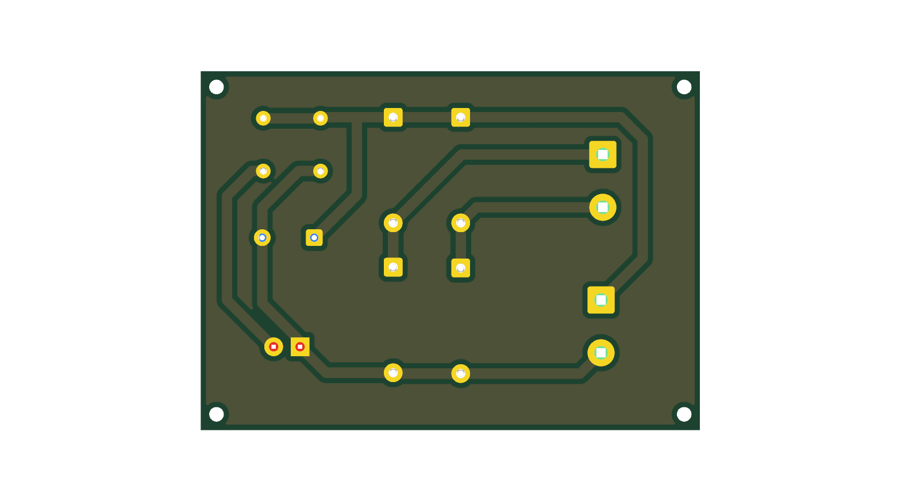
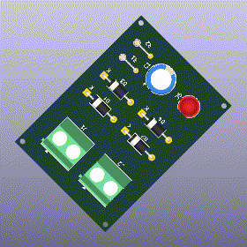
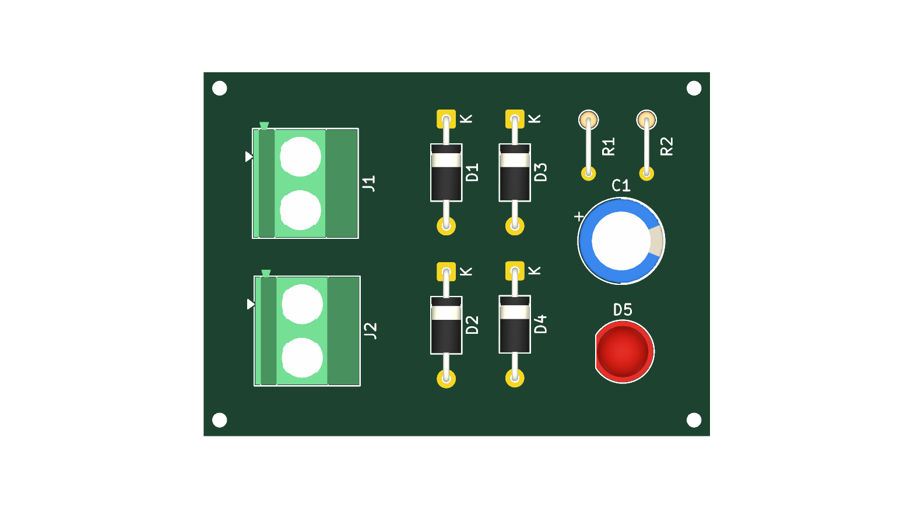

# Ac To Dc Converter

## Description
<!-- PROJECT_DESCRIPTION -->
KiCad PCB design project for Ac To Dc Converter.
<!-- /PROJECT_DESCRIPTION -->

## Board Specifications

| Specification | Details |
|---|---|
| Dimensions | 48.0 × 34.5 mm |
| Area | 1656.0 mm² |
| Thickness | 1.6 mm |
| Copper Layers | 2 |

## Components (10)

| Reference | Value | Footprint | Description |
|---|---|---|---|
| C1 | C_Polarized | Capacitor_THT:CP_Radial_D8.0mm_P5.00mm | Polarized capacitor |
| D1 | D | Diode_THT:D_A-405_P10.16mm_Horizontal | Diode |
| D2 | D | Diode_THT:D_A-405_P10.16mm_Horizontal | Diode |
| D3 | D | Diode_THT:D_A-405_P10.16mm_Horizontal | Diode |
| D4 | D | Diode_THT:D_A-405_P10.16mm_Horizontal | Diode |
| D5 | LED | LED_THT:LED_D5.0mm | Light emitting diode |
| J1 | Screw_Terminal_01x02 | TerminalBlock_Phoenix:TerminalBlock_Phoenix_MKDS-1,5-2-5.08_1x02_P5.08mm_Horizontal | Generic screw terminal, single row, 01x02, script generated (kicad-library-utils/schlib/autogen/connector/) |
| J2 | Screw_Terminal_01x02 | TerminalBlock_Phoenix:TerminalBlock_Phoenix_MKDS-1,5-2-5.08_1x02_P5.08mm_Horizontal | Generic screw terminal, single row, 01x02, script generated (kicad-library-utils/schlib/autogen/connector/) |
| R1 | R | Resistor_THT:R_Axial_DIN0204_L3.6mm_D1.6mm_P5.08mm_Vertical | Resistor |
| R2 | R | Resistor_THT:R_Axial_DIN0204_L3.6mm_D1.6mm_P5.08mm_Vertical | Resistor |

## PCB Renders

### Bottom View

### Rotating 3D View

### Top View

## KiCad Files

- `ac_to_dc.kicad_pcb`
- `ac_to_dc.kicad_pro`
- `ac_to_dc.kicad_sch`

---

_This README is automatically generated by GitHub Actions._
