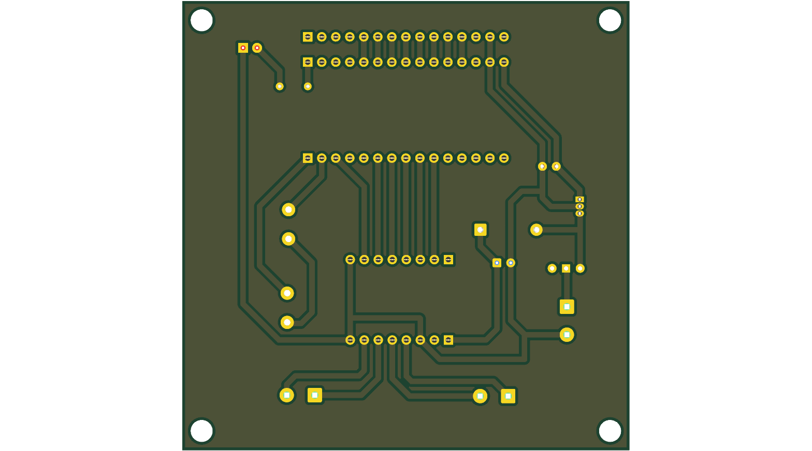
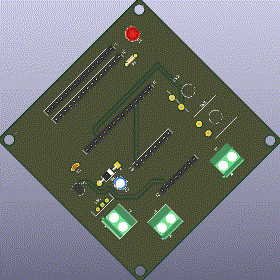
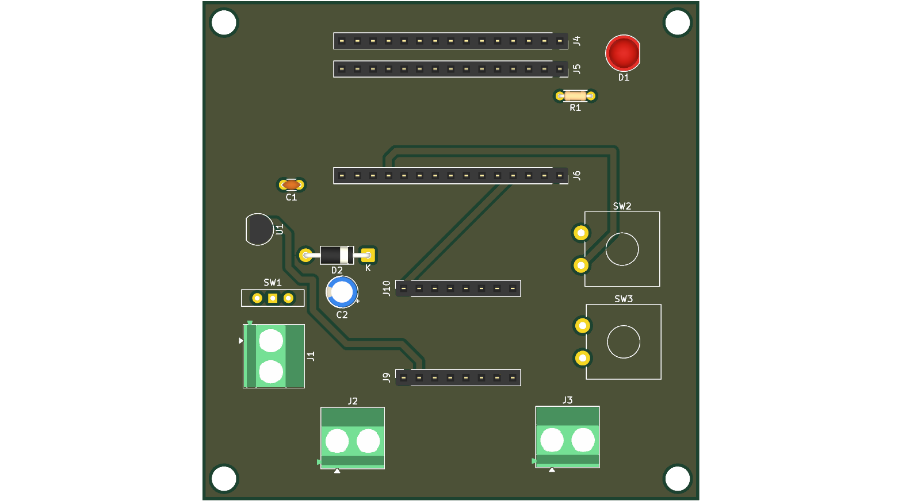

# Lfr Mcb

## Description
<!-- PROJECT_DESCRIPTION -->
KiCad PCB design project for Lfr Mcb.
<!-- /PROJECT_DESCRIPTION -->

## Board Specifications

| Specification | Details |
|---|---|
| Dimensions | 81.0 × 81.5 mm |
| Area | 6601.5 mm² |
| Thickness | 1.6 mm |
| Copper Layers | 2 |

## Components (17)

| Reference | Value | Footprint | Description |
|---|---|---|---|
| C1 | C | Capacitor_THT:C_Disc_D3.0mm_W1.6mm_P2.50mm | Unpolarized capacitor |
| C2 | C | Capacitor_THT:CP_Radial_D5.0mm_P2.50mm | Unpolarized capacitor |
| D1 | LED | LED_THT:LED_D5.0mm | Light emitting diode |
| D2 | D | Diode_THT:D_DO-41_SOD81_P10.16mm_Horizontal | Diode |
| J1 | Screw_Terminal_01x02 | TerminalBlock_Phoenix:TerminalBlock_Phoenix_MKDS-1,5-2-5.08_1x02_P5.08mm_Horizontal | Generic screw terminal, single row, 01x02, script generated (kicad-library-utils/schlib/autogen/connector/) |
| J10 | Conn_01x08_Socket | Connector_PinSocket_2.54mm:PinSocket_1x08_P2.54mm_Vertical | Generic connector, single row, 01x08, script generated |
| J2 | Screw_Terminal_01x02 | TerminalBlock_Phoenix:TerminalBlock_Phoenix_MKDS-1,5-2-5.08_1x02_P5.08mm_Horizontal | Generic screw terminal, single row, 01x02, script generated (kicad-library-utils/schlib/autogen/connector/) |
| J3 | Screw_Terminal_01x02 | TerminalBlock_Phoenix:TerminalBlock_Phoenix_MKDS-1,5-2-5.08_1x02_P5.08mm_Horizontal | Generic screw terminal, single row, 01x02, script generated (kicad-library-utils/schlib/autogen/connector/) |
| J4 | Conn_01x15_Socket | Connector_PinSocket_2.54mm:PinSocket_1x15_P2.54mm_Vertical | Generic connector, single row, 01x15, script generated |
| J5 | Conn_01x15_Socket | Connector_PinSocket_2.54mm:PinSocket_1x15_P2.54mm_Vertical | Generic connector, single row, 01x15, script generated |
| J6 | Conn_01x15_Socket | Connector_PinSocket_2.54mm:PinSocket_1x15_P2.54mm_Vertical | Generic connector, single row, 01x15, script generated |
| J9 | Conn_01x08_Socket | Connector_PinSocket_2.54mm:PinSocket_1x08_P2.54mm_Vertical | Generic connector, single row, 01x08, script generated |
| R1 | 360 | Resistor_THT:R_Axial_DIN0204_L3.6mm_D1.6mm_P5.08mm_Horizontal | Resistor |
| SW1 | SW_Wuerth_450301014042 | Button_Switch_THT:SW_Slide-03_Wuerth-WS-SLTV_10x2.5x6.4_P2.54mm | Switch slide, single pole double throw |
| SW2 | SW_Push | Button_Switch_THT:SW_CW_GPTS203211B | Push button switch, generic, two pins |
| SW3 | SW_Push | Button_Switch_THT:SW_CW_GPTS203211B | Push button switch, generic, two pins |
| U1 | LM2931AZ-5.0_TO92 | Package_TO_SOT_THT:TO-92_Inline | 100mA Low drop-out regulator, Fixed Output 5V, TO-92 |

## PCB Renders

### Bottom View

### Rotating 3D View

### Top View

## KiCad Files

- `LFR_MCB.kicad_pcb`
- `LFR_MCB.kicad_prl`
- `LFR_MCB.kicad_pro`
- `LFR_MCB.kicad_sch`

---

_This README is automatically generated by GitHub Actions._
