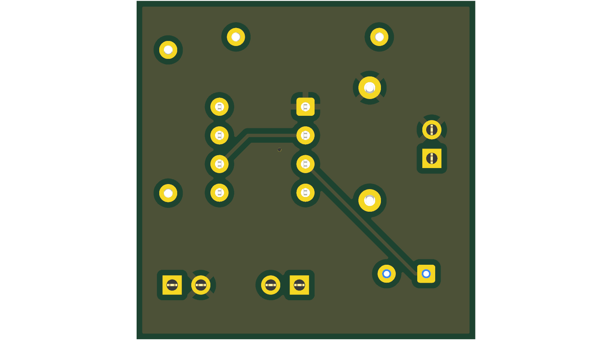
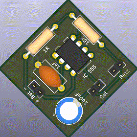
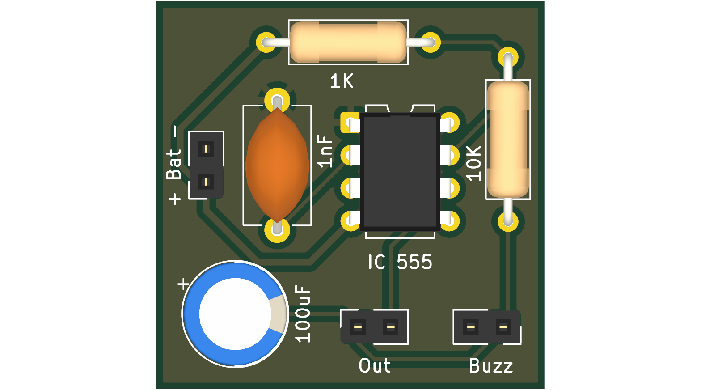

# Queaky Stem Toy

## Description
<!-- PROJECT_DESCRIPTION -->
KiCad PCB design project for Queaky Stem Toy.
<!-- /PROJECT_DESCRIPTION -->

## Board Specifications

| Specification | Details |
|---|---|
| Dimensions | 30.0 × 30.0 mm |
| Area | 900.0 mm² |
| Thickness | 1.6 mm |
| Copper Layers | 2 |

## Components (8)

| Reference | Value | Footprint | Description |
|---|---|---|---|
| C1 | 1nF | Capacitor_THT:C_Disc_D9.0mm_W5.0mm_P10.00mm | Unpolarized capacitor |
| C2 | 100uF | Capacitor_THT:CP_Radial_D8.0mm_P3.50mm | Polarized capacitor |
| R1 | 1K | Resistor_THT:R_Axial_DIN0309_L9.0mm_D3.2mm_P12.70mm_Horizontal | Resistor |
| R2 | 10K | Resistor_THT:R_Axial_DIN0309_L9.0mm_D3.2mm_P12.70mm_Horizontal | Resistor |
| TP1 | Battery | Connector_PinSocket_2.54mm:PinSocket_1x02_P2.54mm_Vertical | 2-polar test point |
| TP2 | Human_IP | Connector_PinSocket_2.54mm:PinSocket_1x02_P2.54mm_Vertical | 2-polar test point |
| TP3 | Buzzer | Connector_PinSocket_2.54mm:PinSocket_1x02_P2.54mm_Vertical | 2-polar test point |
| U1 | NE555P | Package_DIP:DIP-8_W7.62mm | Precision Timers, 555 compatible, PDIP-8 |

## PCB Renders

### Bottom View

### Rotating 3D View

### Top View

## KiCad Files

- `Queaky_STEM_Toy.kicad_pcb`
- `Queaky_STEM_Toy.kicad_prl`
- `Queaky_STEM_Toy.kicad_pro`
- `Queaky_STEM_Toy.kicad_sch`

---

_This README is automatically generated by GitHub Actions._
